# SAPI
<h1 align="center">
  

  <div>개발자를 위한 API 통합 관리 시스템</div>
</h1>

# :one: 프로젝트 개요

## 1. 개발 기간

| 개발기간 | 24.10.14 ~ 24.11.19 |
| --- | --- |

## 2. 구성 팀

| 팀원 | 역할 | 세부 내용 | 
| --- | --- | --- |
| 강세현 | Infra, Back-End Developer | BE, DB, Infra |
| 김문희 | Front-End Developer | FE, 디자인 |
| 박준영 | Front-End Developer | FE, 디자인, Web Socket |
| 박찬호 | Infra, Back-End Developer | Leader, BE, Infra, DB |
| 박용빈 | Back-End Developer | BE, DB, AWS Lambda Server |
| 조성빈 | Front-End Developer | FE, 디자인, Web Socket |

## 3. 기획 의도 및 목표
API 명세와 백엔드/프론트엔드 개발의 협업 과정에서 API 명세가 자주 변경되거나, 백엔드 개발이 완료되지 않은 상황 등 개발 과정에는 여러 문제들이 발생할 수 있습니다.

이 과정에서 API 명세가 복잡해지거나 변경사항이 제대로 반영되어있지 않다면 협업 효율이 저하되며, 개발 일정 지연과 품질 저하로 이어질 수 있습니다.

따라서, 개발의 속도를 높이고 팀 간 커뮤니케이션 문제를 최소화하며, 명세와 구현의 불일치를 사전에 방지하고자 AWS Lambda Server를 이용한 Mock API 구현 및 자동화된 API 검증 시스템을 기획하였습니다.

:star: 목표
| No | Content | 세부 내용 | 
| --- | -------------------- | ----- |
| 1 | API 명세서를 중심으로 팀 간 협업 강화 | 실시간 문서 동시 작성, API 문서화 |
| 2 | 자동화 테스트 및 Mock API 서버 제공 | Mock API 테스트 환경 구축, 테스트 자동화 |
| 3 | 명세서 관리 및 관리 시각화 | 개발 진행 대시보드 |

</br>  
</br>  

# :two: 서비스 기능 소개

## 1. API Document
- API 문서화   
  : 작성된 API 문서는 Overview 화면에서 문서화
  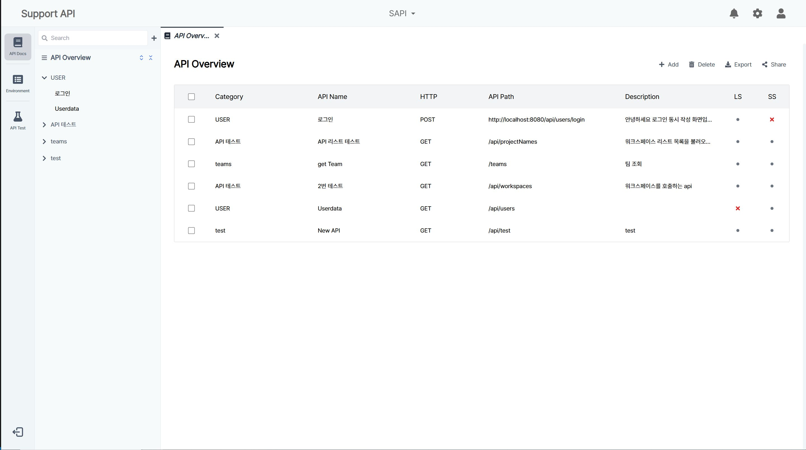

- 웹 기반 에디터 실시간 편집 기능   
  : 웹소켓으로 실시간 문서 작성 협업 기능 구현
  

- 명세 코멘트   
  : 작성된 문서에 코멘트 기능 구현
  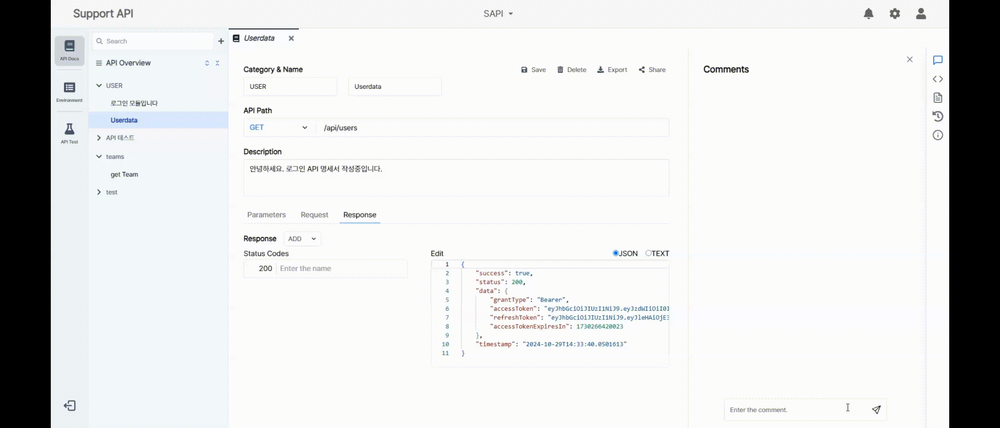

- 명세 추출 (export 기능)   
  : 작성된 API 문서 마크다운 양식 Export 기능 구현
  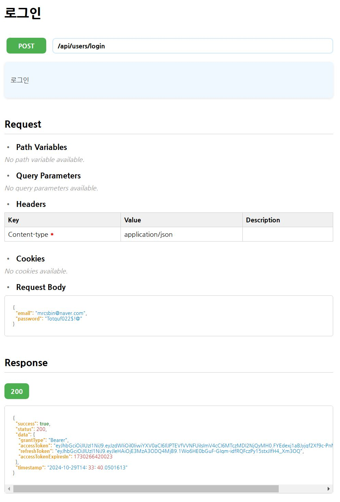

- 코드 스니펫   
  : 작성된 API 문서 코드 스니펫(Axios, Fetch) 기능 구현
  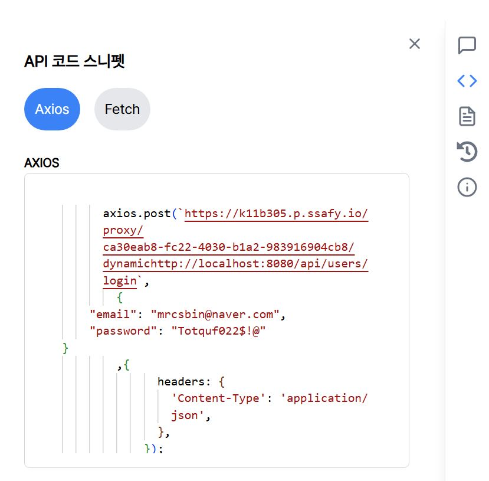

## 2. API Test
- API Test (Back-End 사용자 기준)    
  : 작성한 명세서 기반으로 Back Server에 API TEST 결과 산출   
  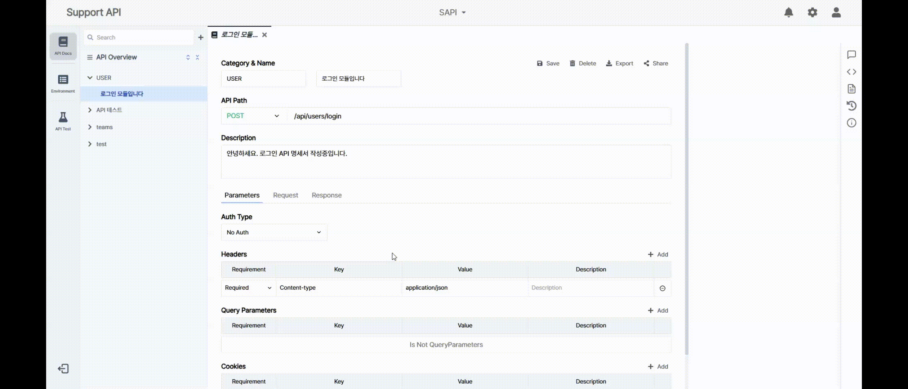

- API Test (Front-End 사용자 기준)    
  : 작성한 코드를 기반으로 Back Server 없이도 Mock API를 통해서 결과 FeedBack   
  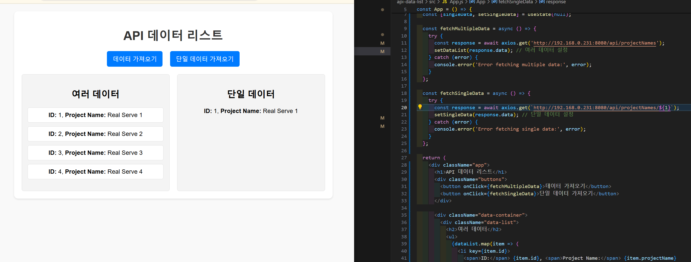
  
- API OverView   
  : 테스트 완료된 데이터는 Overview에서 실시간 확인 및 분석 (LS : Local Status // SS : Server Status)
  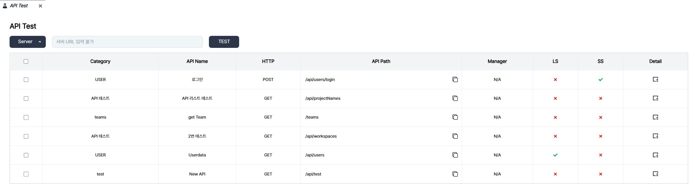

## 3. API DashBoard

- API Dashboard   
  : 테스트 완료 시 실시간 완료 여부 Graph 모니터링
  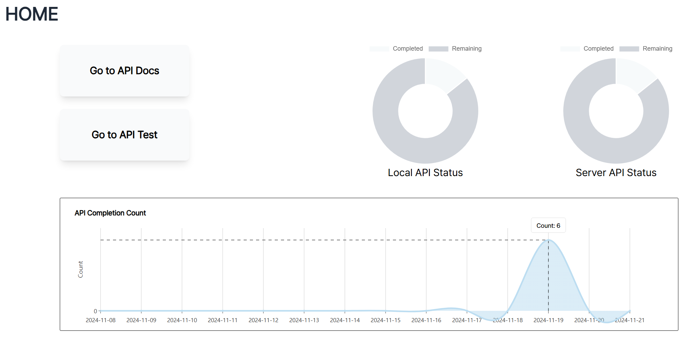

## 4. 추가 기능

- Workspace Interface    
  : 개발 프로젝트 별 환경 구성
  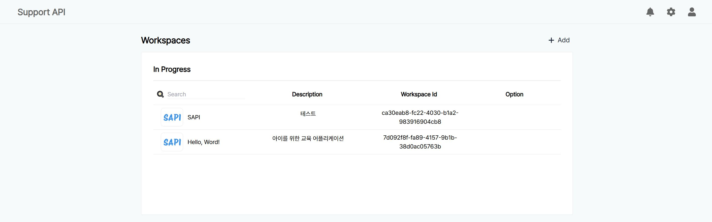

- Setting 환경 구성   
  : User 정보 변경, Theme 설정, Invitation 기능 Alarm 기능
  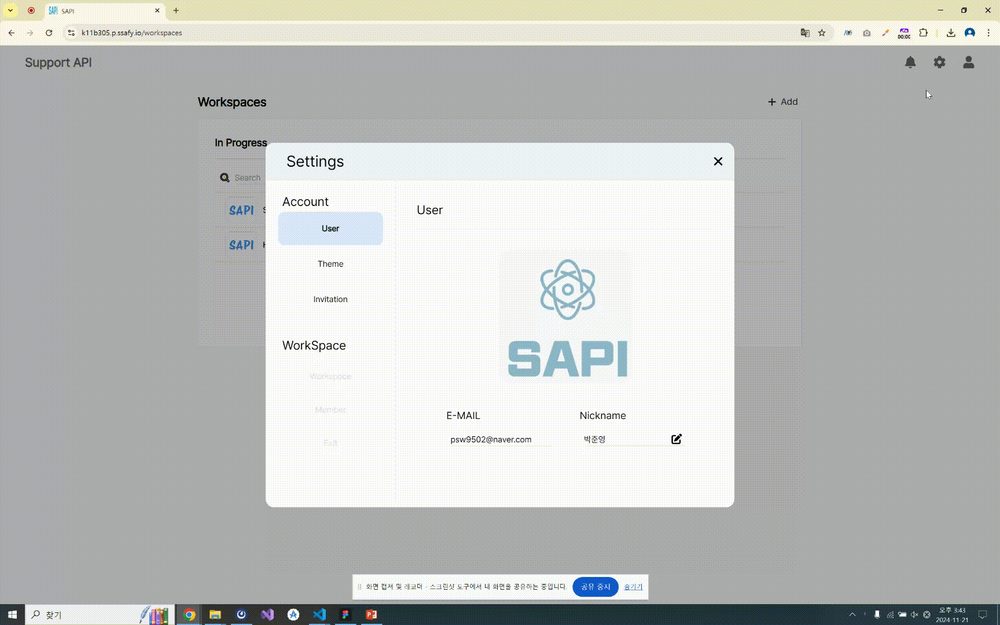

- WorkSpace Setting   
  : 워크스페이스 정보 변경, 유저 초대
  

</br>  
</br>  

# :three: 기술 스택   

## Frontend
  - React
  - Tailwind CSS
  - HTML
  - JavaScript
  - ReactQuery
  - Zustand

## Backend
  - Java 17
  - SpringBoot 3
  - SpringSecurity
  - SSE
  - MySQL 8.0.23
  - Redis
  - Spring Data JPA
  - QueryDSL
  - AWS Lambda, S3
  - Thymeleaf

## Infra
  - AWS EC2
  - Docker
  - Docker Compose
  - Jenkins
  - NGINX
  - Ubuntu 20.04

</br>  
</br>  

# :four: 아키텍처   
<h1 align="center">
  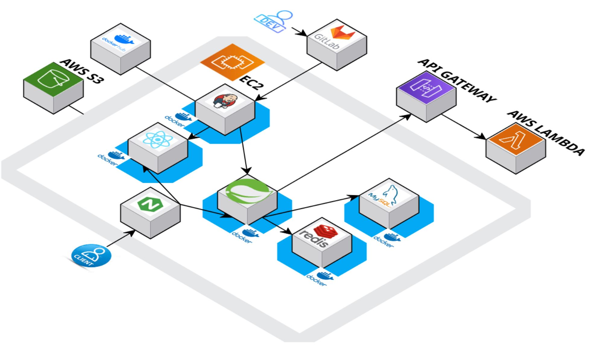  
</h1>
  

</br>  
</br>  
  
# :five: 기대효과  
<h1 align="center">
  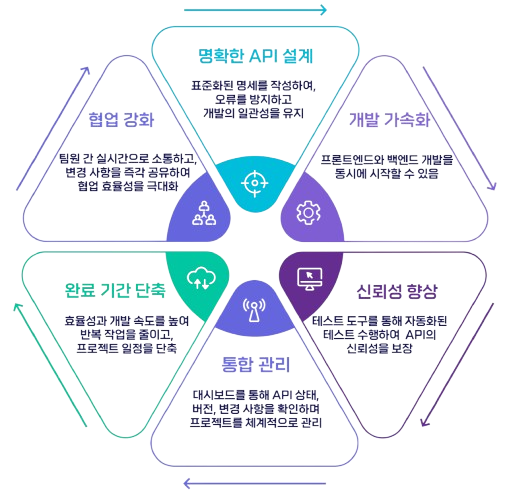
</h1>

# :six: 적용 기술 세부사항

- 추후 작성

# :seven: Git Graph 및 문서 구조


```
frontend                                                                    
├─ node_modules                                  
├─ public                                                                   
│  ├─ 404page.JPG                                                           
│  └─ vite.svg                                                              
├─ src                                                                      
│  ├─ api                                                                   
│  │  ├─ queries                                                            
│  │  │  ├─ useApiDashboardQueries.js                                
│  │  │  ├─ useApiDocsQueries.js                                        
│  │  │  ├─ useApiHistory.js                                               
│  │  │  ├─ useApiTestQueries.js                                         
│  │  │  ├─ useAPIUserQueries.js                                        
│  │  │  ├─ useAuthQueries.js                                             
│  │  │  ├─ useCommentsQueries.js                                     
│  │  │  ├─ useEnvironmentQueries.js                                  
│  │  │  ├─ useNotificationsQueries.js                                 
│  │  │  └─ useWorkspaceQueries.js                                    
│  │  └─ axiosInstance.js                                                   
│  ├─ assets                                                                
│  ├─ components                                                            
│  │  ├─ common                                                             
│  │  │  ├─ Alarm.jsx                                                       
│  │  │  ├─ CheckModal.jsx                                                
│  │  │  ├─ Environment.jsx                                                
│  │  │  ├─ Header.jsx                                                      
│  │  │  ├─ Navbar.jsx                                                      
│  │  │  ├─ Sidebar_nouse.jsx                                             
│  │  │  ├─ TabBar.jsx                                                      
│  │  │  └─ TextInput.jsx                                                   
│  │  ├─ layout                                                             
│  │  │  ├─ Layout.jsx                                                      
│  │  │  └─ NavigationLayout.jsx                                         
│  │  └─ sidebar                                                            
│  │     ├─ ApiDocsSidebar.jsx                                             
│  │     ├─ ApiTestSidebar.jsx                                              
│  │     ├─ DashboardSidebar.jsx
│  │     └─ EnvironmentSidebar.jsx                                        
│  ├─ contexts                                                              
│  │  ├─ WebSocketProvider.jsx                                           
│  │  └─ YjsProvider.jsx                                                    
│  ├─ handlers                                                              
│  │  └─ apiMessagehandler.js                                             
│  ├─ hooks                                                                 
│  │  ├─ useAuth.jsx                                                        
│  │  ├─ useFieldStates.jsx                                                 
│  │  ├─ useOccupationStatus.jsx                                         
│  │  ├─ useTabs.jsx                                                        
│  │  └─ useYjs.jsx                                                         
│  ├─ pages                                                                 
│  │  ├─ ApiTest                                                            
│  │  │  ├─ APItest.jsx                                                                              
│  │  │  ├─ ApiTestDetail.jsx                                               
│  │  │  ├─ ApiTestParameters.jsx                                        
│  │  │  ├─ ApiTestRequestBody.jsx                                     
│  │  │  └─ ApiTestResponseBody.jsx                                   
│  │  ├─ Dashboard                                                          
│  │  │  ├─ ApiDevelopmentProgress.jsx                               
│  │  │  ├─ ApiDevelopmentStatus.jsx                                  
│  │  │  └─ DashboardOverview.jsx                                      
│  │  ├─ docs                                                               
│  │  │  ├─ History                                                         
│  │  │  │  ├─ History.jsx                                                  
│  │  │  │  ├─ HistoryDetail.jsx                                          
│  │  │  │  ├─ HistoryParameters.jsx                                   
│  │  │  │  ├─ HistoryRequest.jsx                                       
│  │  │  │  └─ HistoryResponse.jsx                                     
│  │  │  ├─ DeleteModal.jsx                                               
│  │  │  ├─ HistoryDetail.jsx                                               
│  │  │  ├─ LeftSection.jsx                                                 
│  │  │  ├─ LeftSectionCategory.jsx                                      
│  │  │  ├─ LeftSectionDescription.jsx                                   
│  │  │  ├─ LeftSectionName.jsx                                          
│  │  │  ├─ LeftSectionPath.jsx                                            
│  │  │  ├─ Parameters.jsx                                                 
│  │  │  ├─ ParametersAuthType.jsx                                     
│  │  │  ├─ ParametersCookies.jsx                                       
│  │  │  ├─ ParametersHeaders.jsx                                      
│  │  │  ├─ ParametersQueryParameters.jsx                         
│  │  │  ├─ Request.jsx                                                     
│  │  │  ├─ RequestFormData.jsx                                        
│  │  │  ├─ RequestJson.jsx                                                
│  │  │  ├─ Response.jsx                                                    
│  │  │  ├─ ResponseAdd.jsx                                              
│  │  │  ├─ RightSection.jsx                                                
│  │  │  ├─ RightSectionCodeSnippet.jsx                              
│  │  │  ├─ RightSectionComments.jsx                                 
│  │  │  ├─ RightSectionInfo.jsx                                          
│  │  │  └─ RightSectionSummary.jsx                                   
│  │  ├─ Environment                                                        
│  │  │  ├─ DraggableRow.jsx                                             
│  │  │  ├─ DropdownMenu.jsx                                           
│  │  │  └─ Environment.jsx                                                
│  │  ├─ Settings                                                           
│  │  │  ├─ SettingInvitation.jsx                                           
│  │  │  ├─ SettingMember.jsx                                            
│  │  │  ├─ Settings.jsx                                                    
│  │  │  ├─ SettingTheme.jsx                                              
│  │  │  ├─ SettingUser.jsx                                                 
│  │  │  └─ SettingWorkspace.jsx                                        
│  │  ├─ Workspace                                                          
│  │  │  ├─ CreateWorkspace.jsx                                         
│  │  │  ├─ DoneSection.jsx                                               
│  │  │  ├─ Header.jsx                                                      
│  │  │  ├─ InProgressSection.jsx                                         
│  │  │  ├─ InviteUser.jsx                                                  
│  │  │  ├─ OptionMenu.jsx                                                
│  │  │  ├─ Settings.jsx                                                    
│  │  │  ├─ WorkspaceRow.jsx                                            
│  │  │  ├─ WorkspaceSelection.jsx                                      
│  │  │  └─ WorkspaceTable.jsx                                           
│  │  ├─ 404page.jsx                                                        
│  │  ├─ ApiDocsDetail.jsx                                                  
│  │  ├─ ApiOverview.jsx                                                    
│  │  ├─ Login.jsx                                                          
│  │  ├─ SignUp.jsx                                                         
│  │  └─ Workspace.jsx                                                      
│  ├─ routes                                                                
│  │  └─ AppRoutes.jsx                                                      
│  ├─ stores                                                                
│  │  ├─ useAlarmStore.js                                                   
│  │  ├─ useAuthStore.js                                                    
│  │  ├─ useEnvironmentStore.js                                          
│  │  ├─ useNavbarStore.js                                                 
│  │  ├─ useSidebarStore.js                                                 
│  │  ├─ useTabStore.js                                                     
│  │  ├─ useTestStore.js                                                    
│  │  └─ useThemeStore.js                                                  
│  ├─ styles                                                                
│  ├─ utils                                                                 
│  │  ├─ connectToStomp.js                                                
│  │  └─ cookies.js                                                         
│  ├─ App.jsx                                                               
│  ├─ main.jsx                                                              
├─ Dockerfile                                                               
├─ eslint.config.js                                                         
├─ index.html                                                               
├─ main.cjs                                                                 
├─ nginx.conf                                                               
├─ package-lock.json                                                        
├─ package.json                                                             
├─ postcss.config.js                                                        
├─ README.md                                                                
├─ tailwind.config.js                                                       
└─ vite.config.js                                                           
```
